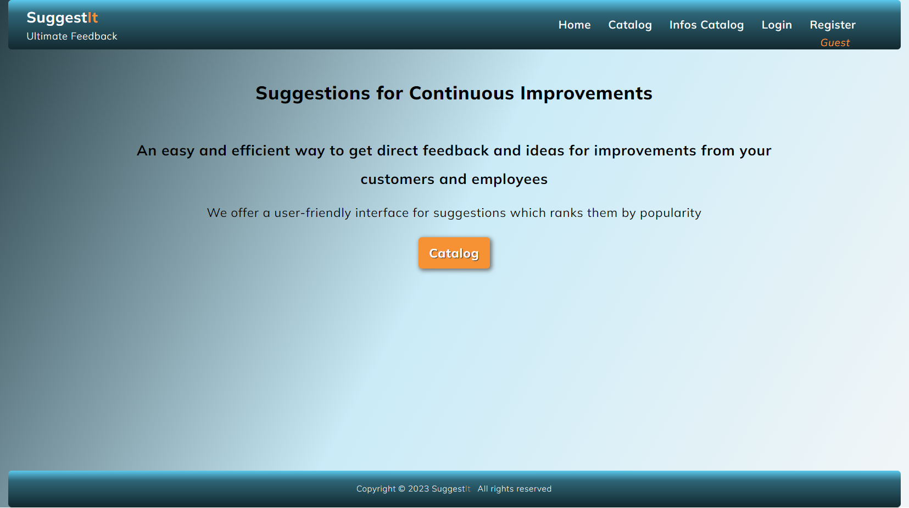

# Suggest**It**
## **Project Assignment: SPA with ReactJs**

This is a ReactJS project assignment for completing [SoftUni](https://softuni.bg/)
ReactJS Course. Details of the assignment are available [here](https://github.com/zhenyahodges/SoftUni-Courses/blob/main/Front_End/REACT/REACT-PROJECT/ReactJS-Project-Assignment.docx).

Deployed at: [https://suggestit-a18f3.web.app](https://suggestit-a18f3.web.app/)

**The server should be started locally for it to work properly, as it's not been deployed yet.**

 ### **Built with:**

 ReactJS, React Router, React Router DOM
### **Router:**

 * createBrowserRouter  with v6.4 data APIs like loader and actions
#
## **About**
Suggest**It** is a web application which provides a simple interface for receiving feedback and suggestions for improvements for companies.
#

### **Welcome**
 

#
### Catalog

Guests & Logged Users can view the Catalog with feedback cards.
#
### **Card Details**
Guests & Logged Users can view the Details of feedback cards.

Logged users, NOT card owners can:
* Add a new suggestion.
* Edit suggestion * *if NOT timed out (1min time limit)*
* Delete suggestion * *if NOT timed out (1min time limit)*
* Vote for a suggestion they are NOT the owner of the suggestion.

Logged users, card owners can:
* Edit a card they created. * *if NOT timed out (1min time limit)*
* Delete a card they created. * *if NOT timed out (1min time limit)*
* Print card
* Email card

Guests cannot edit or delete a card, vote for or add a suggestion.
#
### **Info Catalog**
Additional Info Catalog.
#
### **Info Card Details**
Guests & Logged Users can view the Details of info cards.

Logged users, NOT owners can:
* Print card
* Email card

Logged users, owners can:
* Edit a card they created.
* Delete a card they created.
* Print card
* Email card

Guests cannot edit or delete a card.
#
### **Profile**
Logged users can:
* View their details
* View the feedback cards they created, edit & delete them.  * *if NOT timed out (1min time limit)*
* View the info cards they created, edit & delete them.
* View a list of the suggestions they made, edit & delete them. * *if NOT timed out (1min time limit)*
* Create new feedback cards
* Create new info cards

#
## **Validations & Error Handling**

### **Error elements**
* Error elements applied to route paths.

### **Fetch requests**
* Error handling implemented

### **Loading & Submitting:**
* Buttons show when data is loading or submitting.

### **Inputs: Register**

### Names
* Names should be between 3 and 64  characters.

### Email
* Regex pattern implemented for data validation
* The email address must start with one or more letters, numbers, dots, underscores, percent signs, plus signs, or hyphens before the "@" symbol.
The "@" symbol must be followed by one or more letters, numbers, dots, or hyphens before the domain extension.
The domain extension must consist of at least two letters.
The email address must not have any spaces, tabs, or other special characters.

### Password
* Min 6 characters
* Must match with repeat password when registering. If no match is found, it alerts: *Passwords do not match*

### **Inputs:  Login**
* Email validation and password as above.
* If not found returns: *'Email or password invalid. Please try again.'*

### **Inputs:  Create**
#### **Suggestions**:
* Brand: 30 characters
* Textarea: Max length 150 characters.

####  **Info cards**:
* Text Input: 30 characters
* Website: should contain website address, regex pattern implemented for data validation
* Textarea: Max length 300 characters.

### **Not Found**
* If the page is not found, returns 404 page Not Found, with link back to the home page.
#
### **To run**

In the project directory, you can run:

#### `cd client`
#### `npm start`
\
Start the server:
#### `cd server`
#### `node server.js`

\
Runs the app in the development mode.\
Open [http://localhost:3000](http://localhost:3000) to view it in your browser.
#

