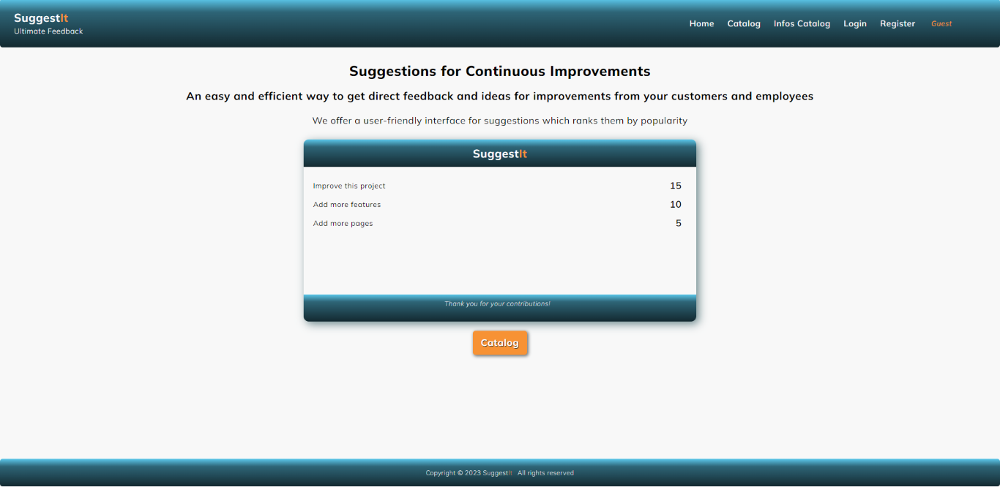

# Suggest**It**

This is a SPA with ReactJS project assignment for completing [SoftUni](https://softuni.bg/)
ReactJS Course. Details of the assignment are available [here](https://github.com/zhenyahodges/SoftUni-Courses/blob/main/Front_End/REACT/REACT-PROJECT/ReactJS-Project-Assignment.docx). Built with ReactJS, React Router DOM,  React Router-   [createBrowserRouter](https://reactrouter.com/en/main/routers/create-browser-router) with v6.4 data APIs like loader and actions; HTML5 and CSS3. Server used: [SoftUni Practice Server](https://github.com/softuni-practice-server/softuni-practice-server).

<!-- 

<a href="https://suggestit-a18f3.web.app">
  

 -->

## **About**

[Suggest**It**](https://suggestit-a18f3.web.app/) is a web application which provides a simple interface for receiving feedback and suggestions for improvements for companies and organisations. Users can vote for the suggestions they like the most. Companies can quickly see which suggestions are most popular.

Deployed [here](https://suggestit-a18f3.web.app/). ***Please note:*** To ensure proper functionality, the **server** must be [initiated locally](https://github.com/zhenyahodges/SuggestIt#initServer) since it has not been deployed yet.
#
### **Demo**

https://github.com/zhenyahodges/SuggestIt/assets/114656373/17df9816-9e42-4cf2-a03b-1d53127b7e06

#

### Catalog

Guests & Logged Users can view the Catalog with feedback cards.

#

### **Card Details**

Guests & Logged Users can view the Details of feedback cards.

Logged users, NOT card owners can:

-   Add a new suggestion.
-   Edit suggestion \* _if NOT timed out (1min time limit)_
-   Delete suggestion \* _if NOT timed out (1min time limit)_
-   Vote for a suggestion if they are NOT the owner of the suggestion.

Logged users, card owners can:

-   Edit a card they created. \* _if NOT timed out (1min time limit)_
-   Delete a card they created.
-   Print card
-   Email card

Guests can view card but cannot edit or delete it,or vote for or add a suggestion.

#

### **Info Catalog**

Additional Info Catalog with optional information for the companies.

#

### **Info Card Details**

Guests & Logged Users can view the Details of info cards.

Logged users, OWNERS can:

-   Edit a card they created.
-   Delete a card they created.
-   Print card
-   Email card

Guests & Logged users NOT owners can:

-   View card
-   Print card
-   Email card

#

### **Profile**

Logged users can:

-   View their details
-   View the feedback cards they created, edit & delete them. \* _if NOT timed out (1min time limit)_
-   View the info cards they created, edit & delete them.
-   View a list of the suggestions they made, edit & delete them. \* _if NOT timed out (1min time limit)_
-   Create new feedback cards
-   Create new info cards

#

## **Validations & Error Handling**

### **Error elements**

-   Error elements applied to route paths.

### **Fetch requests**

-   Error handling implemented

### **Loading & Submitting:**

-   Buttons show when data is loading or submitting.

### **Inputs: _Register_**

### Names

-   Names should be between 3 and 64 characters.

### Email

-   Regex pattern implemented for data validation
-   The email address must start with one or more letters, numbers, dots, underscores, percent signs, plus signs, or hyphens before the "@" symbol.
    The "@" symbol must be followed by one or more letters, numbers, dots, or hyphens before the domain extension.
    The domain extension must consist of at least two letters.
    The email address must not have any spaces, tabs, or other special characters.

### Password

-   Min 6 characters
-   Must match with repeat password when registering. If no match is found, it alerts: _Passwords do not match_

### **Inputs: _Login_**

-   Email validation and password as above.
-   If not found returns: _'Email or password invalid. Please try again.'_

### **Inputs: _Create_**

#### **Suggestions**:

-   Brand: Min length 3 characters- max length 30 characters
-   Suggestion: Min length 5 characters- max length 150 characters.

#### **Info cards**:

-   Brand: Min length 3 characters- max length 30 characters
-   Website address: should contain website address, regex pattern implemented for data validation
-   Textarea: Max length 300 characters.

### **Not Found**

-   If the page is not found, returns 404 page Not Found, with link back to the home page.

#

## **Tests**
React Testing Library and Jest
#

### **To run**

In the project directory:

#### `cd client`

#### `npm start`

\
To initiate the **server**:

#### `cd server`

#### `node server.js`

\
Runs the app in development mode.\
Open [http://localhost:3000](http://localhost:3000) to view it in your browser.

#
